

<table>
<tr>
<td width="220">
  
</td>
<td>

### 👋 Привет, я Никита Павловский!

**FullStack Developer | Vue.js & Java**

*Целеустремлённый разработчик с опытом создания сложных веб-приложений и геоинформационных систем*

</td>
</tr>
</table>

---

##  Обо мне

-  Увлекаюсь нейронными сетями и анализом данных
-  Занимаюсь веб-разработкой
-  Работаю с современными технологиями: **JavaScript** (Vue/Nuxt), **TypeScript**, **Java** (Spring)
-  Постоянно развиваюсь и осваиваю новые инструменты

** Образование:**
- Магистратура СПбГЭТУ «ЛЭТИ» — Информационные системы и технологии (2024-2026)
- Бакалавриат СПбГЭТУ «ЛЭТИ» — Управление в технических системах (2020-2024)

** Текущая позиция:**
 Программист 2 категории в НИЦ СПбГЭТУ «ЛЭТИ» 
  
---

##  Профессиональный опыт

###  НИЦ СПбГЭТУ «ЛЭТИ» | Программист 2 категории
**2023 — настоящее время**

-  Разработка и поддержка веб-приложений на **JavaScript, TypeScript, Vue 3, Java**
-  Создание UI-библиотек и компонентов с нуля для повторного использования
-  Реализация графиков, таблиц и аналитических панелей (**ApexCharts, Vuetify**)
-  Работа с геоинформационными фреймворками — **OpenLayers** и **CesiumJS**
-  Верстка интерфейсов по макетам из **Figma**
-  Разработка **REST API** на **Java Spring**, работа со **Swagger**
-  Написание юнит-тестов и проведение модульного тестирования
-  Командная разработка с использованием **Jira**, участие в спринтах
-  Взаимодействие с бэкендом, аналитиками и тестировщиками

##  Технологический стек

###  Frontend

###  UI Frameworks & Libraries

###  Backend & Databases

###  GIS & Visualization

###  Data Science & ML

###  Tools & Testing

---

##  Достижения

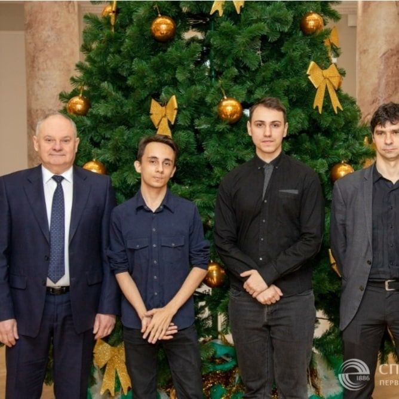

### «Студент года 2020»

Награждён званием **«Студент года»** за значительный вклад в развитие студенческого сообщества СПбГЭТУ «ЛЭТИ».

Признание активной общественной деятельности и лидерских качеств в университетской среде.

 

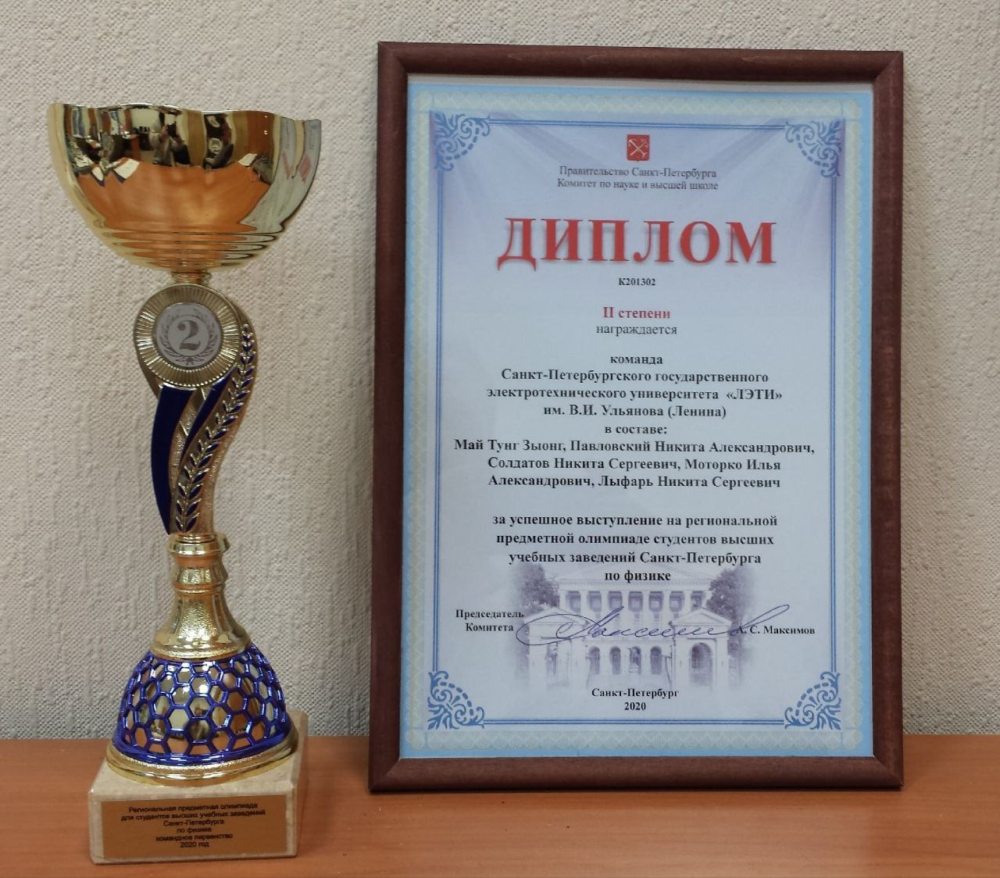

###  Призёр олимпиады по физике

**Диплом II степени** на региональной предметной олимпиаде студентов высших учебных заведений Санкт-Петербурга по физике (2020).

Награда от Правительства Санкт-Петербурга, Комитета по науке и высшей школе. Командное первенство в составе сборной СПбГЭТУ «ЛЭТИ».

 

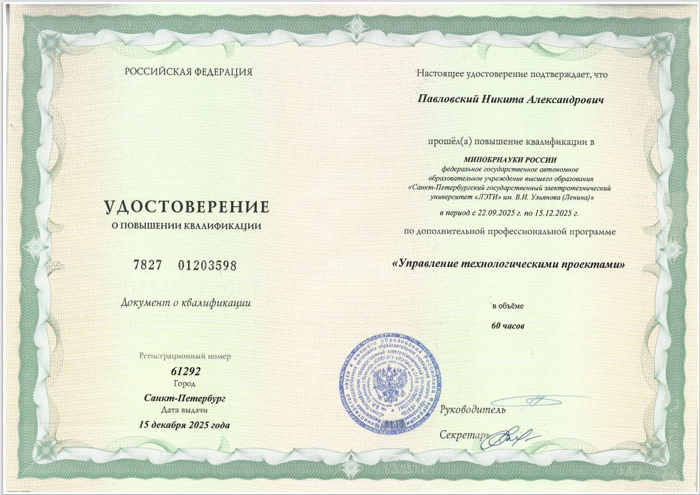

###  Повышение квалификации

**«Управление технологическими проектами»** — программа дополнительного профессионального образования в СПбГЭТУ «ЛЭТИ» (60 часов, 2025).

В рамках программы участвовал в **акселераторе со стартап-проектом Yes Office!** — B2B-платформой управления коммерческой недвижимостью; прошёл путь от идеи до защиты бизнес-модели.

 

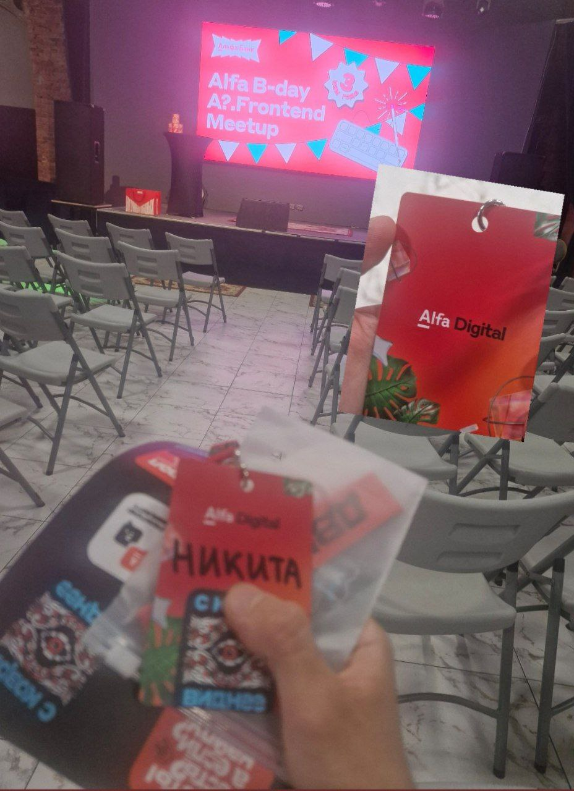

###  Митапы и конференции

**Активный участник митапов и конференций** по фронтенд-разработке.

Постоянно слежу за трендами индустрии, изучаю новые подходы и применяю их в собственных проектах. Открыт для нетворкинга и обмена опытом.

 

---

##  Портфолио и Контакты

###  Связаться со мной:

[_692--17--18-25D366?style=for-the-badge&logo=phone&logoColor=white)](tel:+79816921718)

---

##  Избранные проекты

###  [ИС «Отчёты» — хранение и проверка учебных работ](https://npavlovskij.netlify.app/portfolio/student-reports-system)

Корпоративная ИС для СПбГЭТУ «ЛЭТИ»: централизованная работа с учебной отчётностью студентов кафедры (ИДЗ, доклады, лабораторные и др.). Внедрена на кафедре ИС (акт внедрения по результатам ВКР).

  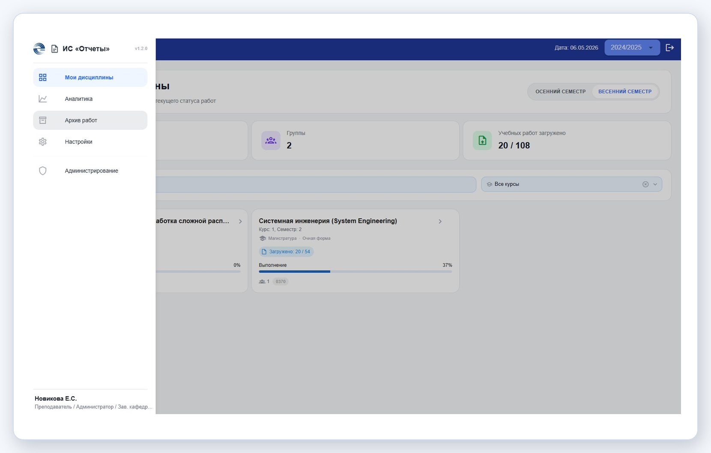

  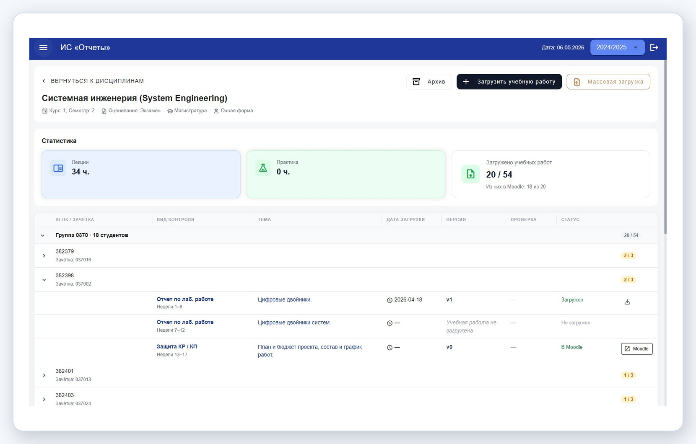
  &nbsp;
  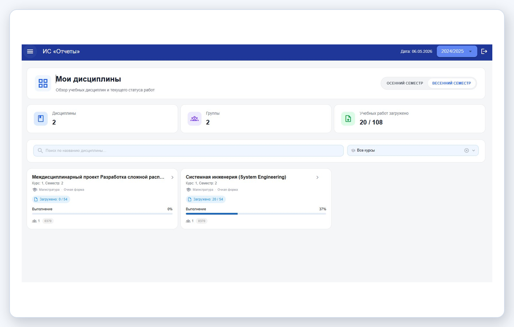

**Стек:** Vue 3 · TypeScript · PWA · Vuetify · Storybook · Vitest · Java Spring · PostgreSQL

**Возможности:**
- Дисциплины и группы преподавателя с фильтрацией
- Загрузка отчётов с привязкой к дисциплине, группе, студенту и теме
- Статусы: загружено / не загружено / проверено
- Аналитика по дисциплинам, семестрам и преподавателям
- Экспорт в Excel и графиков в PNG
- PWA-режим; доклады на конференциях СПбГЭТУ «ЛЭТИ»

---

###  [Niklad — геоинформационное приложение (GIS)](https://npavlovskij.netlify.app/portfolio/gis-green-zones)

ГИС-клиент для **инвентаризации зелёных зон**: ортофото, сегментация и объекты инфраструктуры на одной карте (дипломный проект).

  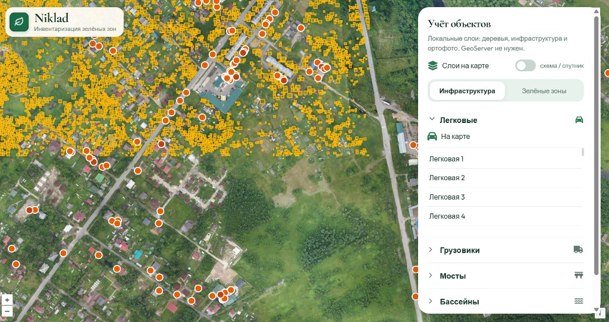

  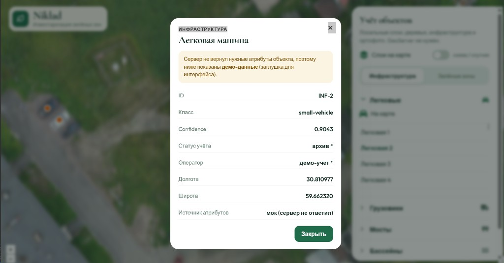
  &nbsp;
  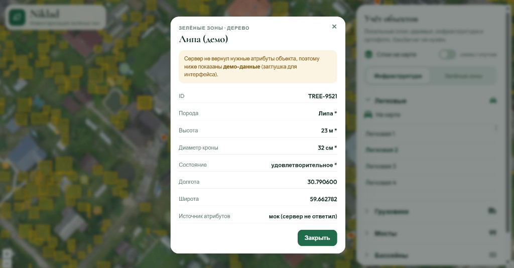

**Стек:** HTML · CSS · JavaScript · OpenLayers · GeoServer · PostGIS · GeoTIFF · DeepForest · SegFormer

**Возможности:**
- Ортофото-мозаика и детальный снимок Саблино 5 см
- Слой «Покрытие» — маска сегментации (preds)
- Вкладки «Инфраструктура» / «Зелёные зоны», фильтры классов
- Карточки объектов по клику на карте или в списке
- Ctrl + выделение области — число деревьев, площадь и плотность
- Локальный режим без GeoServer (GeoJSON + веб-растры) или полный контур WMS/WFS

---

###  [Yes Office! — платформа управления коммерческой недвижимостью](https://npavlovskij.netlify.app/portfolio/yes-office)

Цифровая B2B-платформа для управляющих компаний, девелоперов и собственников бизнес-центров: интерактивная карта объектов, документооборот и аналитика использования пространства в реальном времени. Разработана в рамках акселератора СПбГЭТУ «ЛЭТИ».

  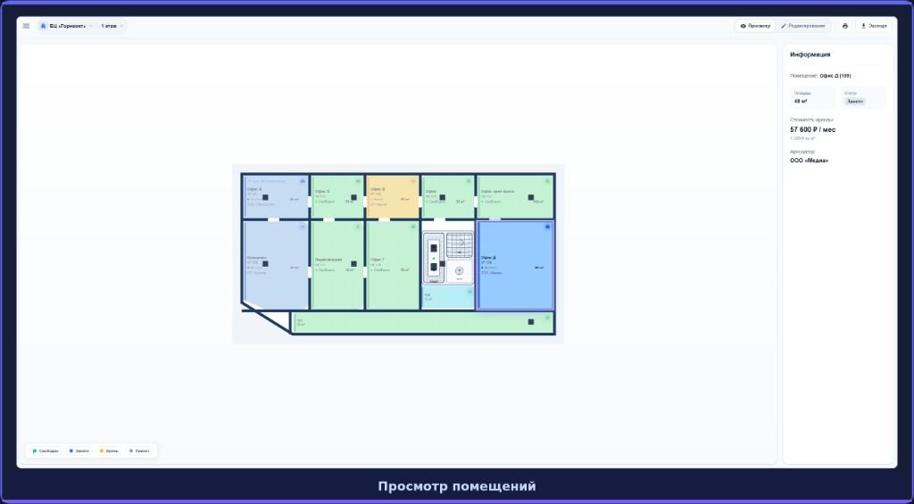

  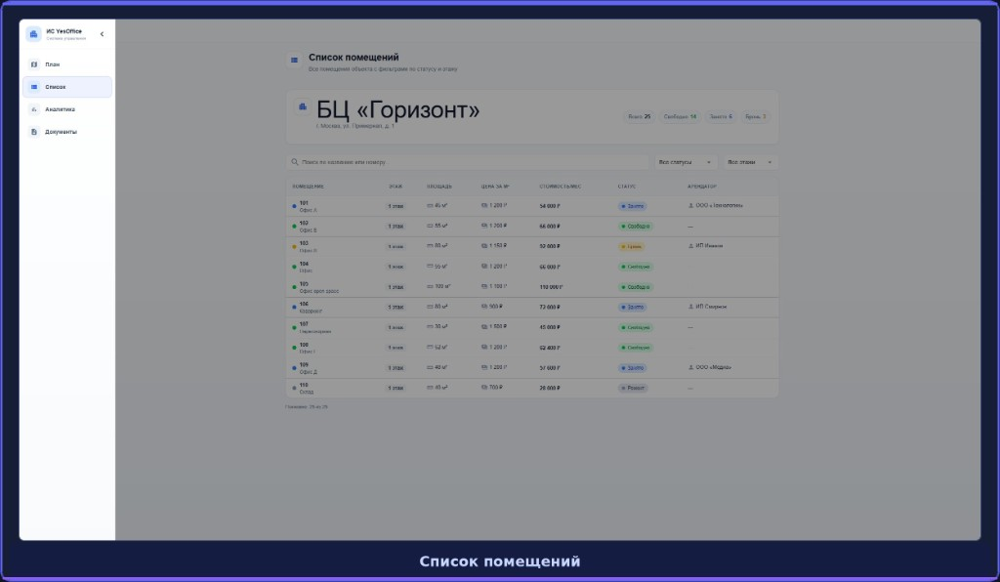
  &nbsp;
  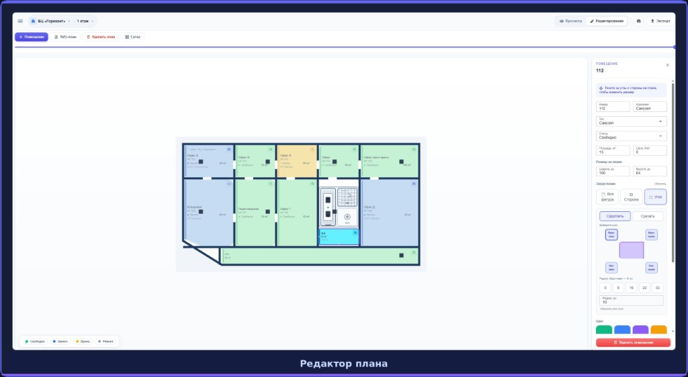

  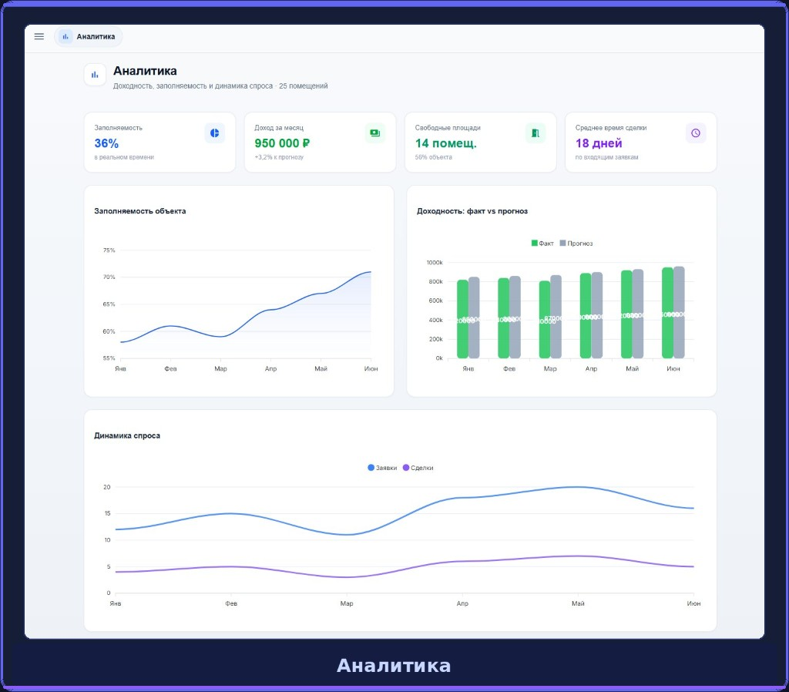
  &nbsp;
  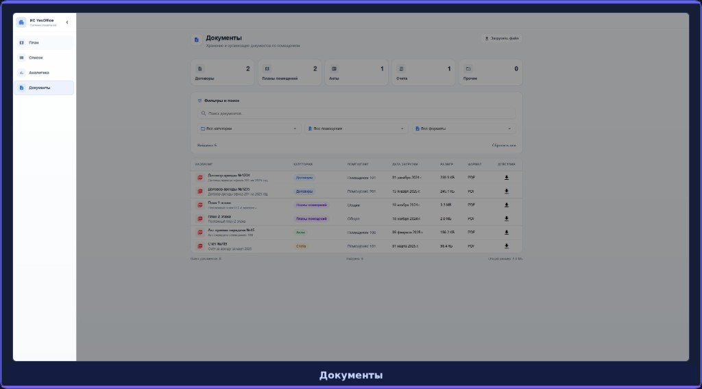

**Стек:** Vue 3 · UX/UI · Интерактивные карты · Аналитика · Документооборот · Big Data

**Возможности:**
- Визуальный контроль объектов на интерактивной карте
- Модули аналитики доходности и заполняемости
- Документооборот для управления коммерческой недвижимостью
- UX/UI-интерфейс по результатам интервью с рынком
- Бизнес-модель, юнит-экономика и презентации для инвесторов

---

###  [Карьерная неделя ЛЭТИ](https://npavlovskij.netlify.app/portfolio/career-week)

Информационный сайт Студенческой карьерной недели СПбГЭТУ «ЛЭТИ»: программа, регистрация участников и работодателей, карта и схема зала. **Сайт использовался вузом при проведении мероприятия.**

  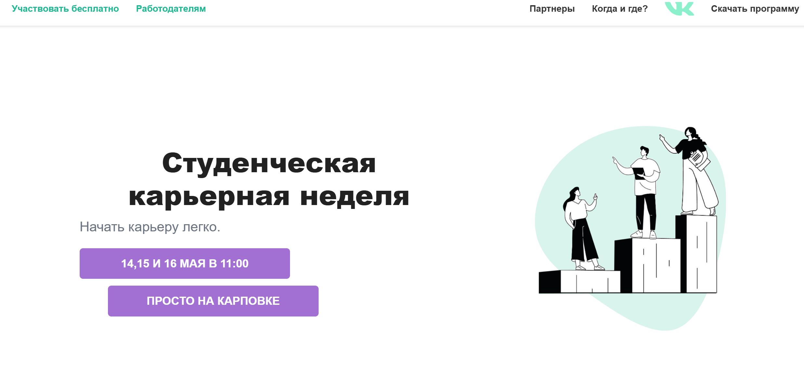

  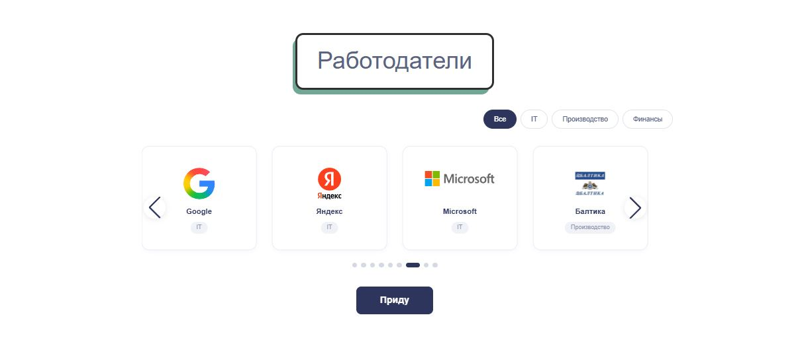
  &nbsp;
  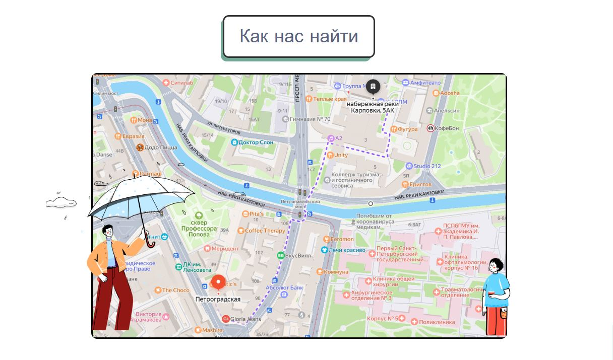

**Стек:** Vue · Nuxt 3 · JavaScript · HTML · CSS · Figma

**Возможности:**
- Использовался при проведении СКН в СПбГЭТУ «ЛЭТИ»
- Многошаговые формы регистрации участников и работодателей
- Программа мероприятий по дням, карусель работодателей
- Карта проезда и интерактивная схема зала
- Полностью адаптивный UI по собственному дизайну в Figma

---

<table>
<tr>
<td width="50%" valign="top">

###  [Портфолио-сайт](https://npavlovskij.netlify.app/)

**Nuxt 3 · TypeScript · Vuetify · SCSS · Storybook · Vite**

Личный сайт с проектами, таймлайном и интерактивными элементами. Полная документация интерфейсов через Storybook.

</td>
<td width="50%" valign="top">

###  [KinOx — онлайн-кинотеатр](https://kinoxmovie.netlify.app/)

<a href="https://kinoxmovie.netlify.app/">
  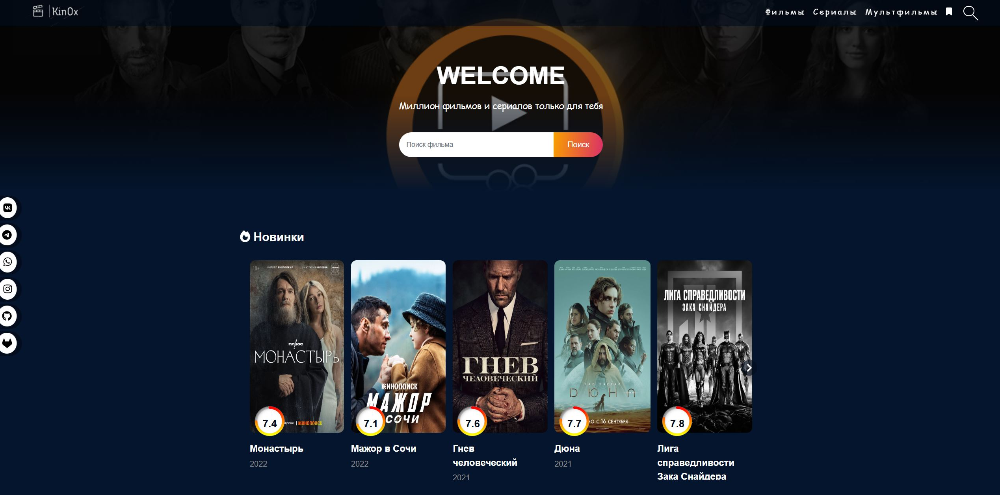
</a>

**Vue 3 · SCSS · Jest · PrimeVue · Storybook**

Современное SPA для поиска фильмов с фильтрами, избранным, оценками. Интеграция с **TMDB API**, тестирование через **Jest**.

</td>
</tr>
<tr>
<td width="50%" valign="top">

###  [Cafe Bill Splitter](https://billatthecafe.netlify.app/)

**Vue · SCSS · PrimeVue · Storybook**

Приложение для разделения счёта в кафе с учётом чаевых и расчётом для каждого участника. Минималистичный UI.

</td>
<td width="50%" valign="top">

###  [Анализ данных — Сбер](https://github.com/NickPavlovskii/sber)

**Python · Pandas · NumPy · Seaborn · Matplotlib**

Анализ временных рядов по объёмам расчётных счетов физических лиц. Прогнозирование стабильных уровней остатков средств (UMP).

</td>
</tr>
</table>

---

##  Ключевые компетенции

<table>
<tr>
<td width="50%">

-  Принципы **SOLID** и **ООП**
-  Проектирование архитектуры приложений
-  Чистый и поддерживаемый код
-  UI/UX дизайн и работа с **Figma**

</td>
<td width="50%">

-  **REST API** разработка и интеграция
-  Юнит-тестирование и модульное тестирование
-  Agile методологии и работа в команде
-  Геоинформационные системы и картография

</td>
</tr>
</table>

---

  
###  Открыт для новых технологий и интересных проектов!

** Буду рад сотрудничеству и новым вызовам!**

<!-- Анимированный футер с волной -->

